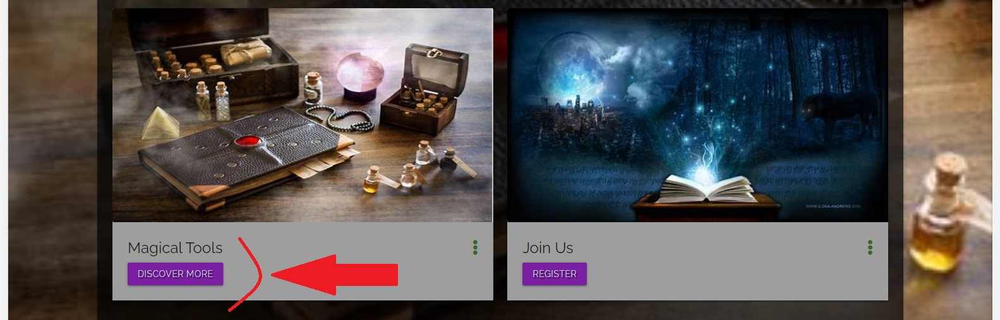
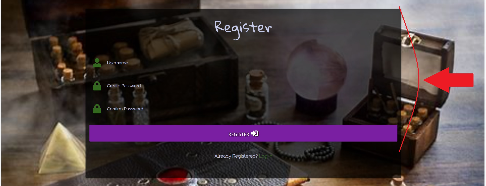

# Magic Spells

* [Click here](https://magic-spells-project.herokuapp.com/) and view the live project.

# Table of contents

1. [Introduction](#Introduction)
2. [UX](#UX)
   * [Strategy](#Strategy)
      * [Website strategy](#Website-strategy)
      * [Target audience](#Target-audience)
      * [External Visitor's goal's](#External-Visitor's-goal's)
      * [Ideal client](#Ideal-client)
      * [Site Owner's goal's](#Site-Owner's-goal's)
   * [Scope](#Scope)
      * [User stories](#User-stories)
      * [Features](#Features)
   * [Structure](#Structure)
      * [Site structure](#Site-structure)
   * [Skeleton](#Skeleton)
      * [Quick sketch](#Quick-sketch)
      * [Wireframes](#Wireframes)
   * [Design](#Design)
      * [Colour scheme](#Colour-scheme)
      * [Fonts](#Fonts)
      * [Media](#Media)
      * [Languages](#Languages)
      * [Technologies Used](#Technologies-Used) 
3. [Completed Live Site](#Completed-Live-Site)
   * [Existing features](#Existing-features) 
   * [Features to Implement in future](#Features-to-Implement-in-future)  
4. [Testing](#Testing)
   * [W3C Validation](#W3C-Validation)
   * [Jshint Validation](#Jshint-Validation)
   * [PEP8 Validation](#PEP8-Validation)
   * [User stories testing](#User-stories-testing)
   * [Functional testing](#Function-testing)
5. [Database Design](#Database-Design)
   * [Database schema](#Database-schema)
6. [Deployment](#Deployment)
   * [MongoDB Configuration](#MongoDB-Configuration)
   * [Heroku Deployment](#Heroku-Deployment)
   * [Forking the Repository](#Forking-the-Repository)
   * [Creating a Clone](#Creating-a-Clone)
7. [Credits](#Credits)
   * [Images and text](#Images-and-text)
   * [Helpfull sites](#Helpfull-sites)
   * [Acknowledgements](#Acknowledgements)

# Introduction

I have always been interested in old traditions, from pagan times to white witchcraft and the the connections that these create with the mind spirit and the earth, living in a world that has become sick, the earth is unhealthy and our lifesyles are stressed where we have lost all connections and stopped listening to our planet.

So I was inspired to follow and seek traditional ways to help bring our mind spirit and body back to the basics where we hear ourselves again, listen to the world around us in a spirital, pure sense and awaking the true us as emotional spiritual beings.

I am creating the perfect collection of spells for the amatuer who desires to channel the potent magic of nature.

# UX

## Strategy
### Website strategy

* Create online presence 
* Create database of spells 
* Promote emotional wellbeing
* Provide information about creating spells 
* Links available for products relating to spells 
* Provide an opportunity to log in/register with the spiritual community 
* Provide an opportunity to seek other user spells 
* Provide an opportunity for user to add/edit/delete spells 
* Provide access for web designer/admin to add/edit/delete spell categories

### Target audience

* People seeking a spiritual path
* People looking to reconnect with the magic of nature
* People seeking inspiration

### External Visitor's goal's

* To find easy accessable information about life spells
* To find a community with the same belief system
* To be able to become a member of the community
* To be able to quickly navigate throughout the site and find any information required
* To be able to share spells with other members in community
* To be able to search for needed spell 
* To locate a link for an external resource

### Ideal client

* A person who is free thinking
* A person who is spiritualy aware
* A person who wants to broaden there horizons
* A person who is seeking a like minded community

### Site Owner's goal's

* To build a platform to be able to grow a community of wellbeing and mindfulness
* To provide an opportunity for new user to become a member of the spiritual community
* To provide a database of the website member spells
* To provide an option for members to add/edit/delete their own spells
* To provide separate options for admin to add/edit/delete spell categories
* To provide a link to external sites for magical tools

## Scope
### User stories

1. As a new user to this website, I want to find information that is quick and easy to navigate through the website, so that I can better develop my personal wellbeing.
2. As a new user to this website, I want to get a wide range of spells, so I can apply them to my lifestyle. 
3. As a new user to this website, I want to have the option to search for the spells I'm looking for, so I can find what I need.
4. As a new user to this website, I want to access an external resource link for magical tools, so I can purchase a product.
5. As a new user to this website, I want to join this website, so I can become a part of this community.
6. As an user to this website, I want to share my spells with other members in the community, so I can help people in their challenges.
7. As an user to this website, I want to take an action on shared spells, so I can develop and grow the database.
8. As an admin of this website, I want to take an action on information provided on this website, so I can manage categories of spells.

### Features

* An easy navigation throughout the website with fixed navbar
* A link button for Magic Spells database
* A link button for Magical Tools purchase
* A link button for new users to register into website
* A search field to find quicker necessary information 
* A responsive design to be able target broader audiences

## Structure

### Site structure

## Skeleton
### Quick sketch

### Wireframes

View of the main home page for website:

 

Views of the rest pages on website:

* [Spells](project_files/wireframes/wireframes_spells.png "Spells")
* [Magical Tools](project_files/wireframes/wireframes_tools.png "Magical Tools")
* [Log In](project_files/wireframes/wireframes_log_in.png "Log In")
* [Register](project_files/wireframes/wireframes_register.png "Register")
* [User Profile](project_files/wireframes/wireframes_profile.png "User Profile")
* [Add Spell](project_files/wireframes/wireframes_add.png "Add Spell")
* [Manage Spell Categories](project_files/wireframes/wireframes_categories.png "Manage Spell Categories")

## Design
### Colour scheme

Colours of purple, indigo, light green, light grey and red palette [mycolor.space](http://mycolor.space) is used throughout site.

### Fonts

Gloria Hallelujah, Raleway fonts are the main fonts for website and Sans Serif font is used as fallback.

### Media

Card Panel and contrasting colours are used to strike and catch the user's attention to promote the website.

### Languages

This project uses [HTML5](https://en.wikipedia.org/wiki/HTML5) Hypertext Markup Language (HTML), [CSS3](https://en.wikipedia.org/wiki/CSS) Cascading Style Sheets (CSS), [jQ](https://en.wikipedia.org/wiki/JQuery) jQuery (jQuery) and [Python](https://en.wikipedia.org/wiki/Python_(programming_language)) Python.

### Technologies Used

* [BSON](https://bsonspec.org/) - bson.objectid is a required dependency for MongoDB management system.
* [MongoDB](https://www.mongodb.com/) - used for database functionality.
* [MongoDB Atlas](https://www.mongodb.com/cloud/atlas) - used to host the database.
* [mycolor.space](http://mycolor.space) - used for colour palette throughout the site.
* [Materialize Css](https://materializecss.com/about.html) - library used to simplify the structure of website and make it responsive.
* [Google Fonts](https://fonts.google.com/) - were used throughout the site.
* Icons on website were added with [Font Awesome](https://fontawesome.com/).
* [Flask](https://flask.palletsprojects.com/en/1.1.x/) - framework used to create and populate the templates.
* [Jinja](https://jinja.palletsprojects.com/en/3.0.x/) - Jinja templating language was used to simplify and display backend data in html.
* [JQuery](https://jquery.com/) - used to activate the Materialize functionality.
* [PyMongo](https://pypi.org/project/pymongo/) - flask_pymongo used for interacting with MongoDB database from Python.
* [Werkzeug](https://werkzeug.palletsprojects.com/en/2.0.x/) - used for password hashing and authentication.
* [Git](https://git-scm.com/) - used for version control to commit to Git and push to Heroku.
* Project code stored on [GitHub](https://github.com/).
* [gitpod.io](https://gitpod.io/workspaces) was used for coding.
* [Heroku](https://www.heroku.com/home) - cloud platform used to deploy application.
* [PEP8](https://www.python.org/dev/peps/pep-0008/) - used to check code for PEP8 requirements.
* [PEP8online](http://pep8online.com/) - used to check code for PEP8 requirements.
* [RandomKeygen](https://randomkeygen.com/) - used to generate secure password to Secret Key.
* Wireframes were created on [Balsamiq](https://balsamiq.com/).
* [Am I Responsive!](http://ami.responsivedesign.is/) website to review projects responsiveness.
* [jshint.com](http://jshint.com) used for jQuery code validation.
* [W3C Markup Validation Service](https://validator.w3.org/) used for HTML code validation.
* [W3C CSS Validation Service](https://jigsaw.w3.org/css-validator/) used for CSS code validation.

# Completed Live Site

* [Click here](https://magic-spells-project.herokuapp.com/) and view the live site.

## Existing features 

Every page of the website features a consistently responsive and intuitive layout and navigational system:

**General features**

* Fixed navbar to be seen at all times.
* Responsive site on all devices.
* Navbar shown as a collapsible navbar (hamburger button) triggered at tablets and mobile devices.
* Search bar allowing users to search for spells.

**Home Page**

* Home page features an eye catching and modern design.
* Users can get redirected directly to Spell page, Magical Tools page and Register page.

**Spells Page**

* Users can search for spells.
* Users can read spells and see who added the spells.

**Magical Tools Page**

Using card layout, users can discover more about available Magical Tools and get redirected to the site and buy the products.

**Log In Page**

* Log In is possible after registered.
* User gets a flash message when loged in.
* Users can be redirected directly to Registration Page if not already registered.
* User get redirected to Profile Page after logged in.

**Log Out**

* User get redirected to Log In Page after loging out.
* User gets a flash message when loged out to verify user loged out.

**Register Page**

* New visiters can register to website.
* New visiter has to confirm created password on second password field for more security. This option was added later as per mentors advice.
* User gets a flash welcome message at Profile page when registered.
* Visitor can be redirected directly to Log In Page if already registered.
* Visitor gets redirected to Profile Page after registered.

**Profile Page**

* Users can see them own added spells.
* If user hasn't added any spells, a suggestion to do that is presented along with a button to redirect directly to Add Spell page.
* Users can edit, delete and add spells.
* If user is Admin, than another option for Manage Categories is available, where Admin can add, edit and delete spell categories.

**Add Spells**

* User can choose between categories, add a spell title, add a spell description, add ingredients, process for the spell, add date of spell added.
* User gets a flash message when added a spell.
* After adding spell, user is redirected to spell page.

**Edit Spell**

* User can edit info on one or more sections in the spell.
* User gets a flash message when edited a spell.
* After editing spell, user is redirected to spell page.

**Delete Spell**

* Only logged in user is able to delete them own spells.
* User gets a confirmation pop-up for deleted spell when deleting a spell.

## Features to Implement in future

* Provide ability for admin to delete other user spells
* Provide the structure where pictures match the spell category on selection
* Ability to reset an account password
* Create a chat/forum for the community to grow

# Testing

* Tested on Chrome, Firefox and Microsoft Edge desktop version browsers.
* Chrome DevTools was used to test variety of devices such as Desktop, Laptop, iPhone7, iPhone 8, Galaxy S5 and iPad for responsiveness.
* Testing was done to ensure that layout and all Links were working correctly.
* [Lighthouse report on Developer tools](project_files/website/lighthouse.jpg "Lighthouse Report")

## W3C Validation

To validate every page of the project, that there were no syntax errors, these two Validators were used, W3C Validator and W3C CSS Validator.
To make make it easier to validate html code, since using jinja templating language throughout all pages, which results in errors in online validators. I used URL address.
For W3C Css Validtor I copied css code directly.

* [W3C Validator](project_files/validators/w3c_1.jpg "W3C Validator")
* [W3C CSS Validator](project_files/validators/W3c_css.pdf "W3C CSS Validator")

## Jshint Validation

For this project I used jQuery - JavaScript Library for MaterializeCSS initialization: "Write less, do more."
Jshint were used to validate jQuery file of this project. [Click](project_files/validators/jshint.jpg) to view report.

## PEP8 Validation

Python code checked for PEP8 requirements. [Click](project_files/validators/pep8.jpg) to view report.

## User stories testing

   1. As a new user to this website, I want to find information that is quick and easy to navigate through the website, so that I can better develop my personal wellbeing.

The Navigation bar is implemented into the website, so that any new user is able to find any information quick and easy navigating through th website.

This Navigation bar is implemented on the desktop and laptop view:

This Navigation bar is implemented on tablet and mobile view:

   2. As a new user to this website, I want to get a wide range of spells, so I can apply them to my lifestyle.

Link button "Search for Spell" on Home page leads to Spells page which provides a library with wide range of spells.

   3. As a new user to this website, I want to have the option to search for the spells I'm looking for, so I can find what I need.

Search Bar is implemented on top of the Spell library with buttons "Reset" and "Search" for user to search for spells.

 

   4. As a new user to this website, I want to access an external resource link for magical tools, so I can purchase a product.

Home page provides eye catching layout from cards for user access external resource link. Link navigates to Magical Tools page and provide opportunity for user actually purchase product.

   5. As a new user to this website, I want to join this website, so I can become a part of this community.

Navigation Bar provides user link for Register, also beautiful card welcome for user to Join Community and Register. Clicking on the links user is redirected to Register page. 

   6. As an user to this website, I want to share my spells with other members in the community, so I can help people in their challenges.

As an user, website provides option to add spell to an existing library and any member of this website is able to access it.

   7. As an user to this website, I want to take an action on shared spells, so I can develop and grow the database.

On users profile member can see his/hers own added spells and edit or delete them. Meanwhile user can click on link for spells and access all of other user added spells.

   8. As an admin of this website, I want to take an action on information provided on this website, so I can manage categories of spells.

Only Admin has privilege to Manage Categories of the spells on this site.

   
## Functional testing

Throughout the website every link, field and icon was tested and all results are displayed on the table below:

| Location | Type | Expected Result | Actual Result | Pass/Fail/Not executed|
| :----: | :----: | :----: | :----: | :----: |
| Navbar | *Home* link | Click on *Home* link navigates to Top of page | Navigates to Top of page | Pass |
| Navbar | *Spells* link | Click on *Spells* link navigates to Spells page | Navigates to Spells page | Pass |
| Navbar | *Magical Tools* link | Click on *Magical Tools* link navigates to Magical Tools page | Navigates to Magical Tools page | Pass |
| Navbar | *Log In* link | Click on *Log In* link navigates to Log In page | Navigates to Log In page | Pass |
| Navbar | *Register* link | Click on *Register* link navigates to Register page | Navigates to Register page | Pass |
| Navbar | *Profile* link | Click on *Profile* link navigates to Profile page | Navigates to Profile page | Pass |
| Navbar | *Add Spell* link | Click on *Add Spell* link navigates to Add Spell page | Navigates to Add Spell page | Pass |
| Navbar | *Log Out* link | Click on *Log Out* link navigates to Log In page | Navigates to Log In page | Pass |
| Home page | *Search for Spell* link | Click on *Search for Spell* link navigates to Spells page | Navigates to Spells page | Pass |
| Home page | *Discover More* link | Click on *Discover More* link navigates to Magical Tools page | Navigates to Magical Tools page | Pass |
| Spells page | Search form input field | Search form input field allows to type a text | Allows to type a text | Pass |
| Spells page | Search form *Reset* link | Search form *Reset* link resets all Spells page | Resets all Spells page | Pass |
| Spells page | Search form *Search* button | Search form *Search* button search for text from input field throughout all spells and display matching spells | Search for text from input field throughout all spells and display matching spells | Pass |
| Magical Tools | *Buy Now* link | Click on *Buy now* link navigates to [website](https://whitemagickalchemy.com/witchcraft-supplies/?sort=featured&page=2) | Navigates to to [website](https://whitemagickalchemy.com/witchcraft-supplies/?sort=featured&page=2) | Pass |
| Log In page | Log In form username input field | Log In form username input field allows to type and validate a username | Allows to type and validate a username | Pass |
| Log In page | Log In form password input field | Log In form password input field allows to type and validate a password | Allows to type and validate a password | Pass |
| Log In page | Log In form *Log In* button | Log In form *Log In* button verify username, password and redirect to user profile page | Verify username, password and redirect to user profile page | Pass |
| Log In page | Log In form *Register Account* link | Log In form *Register Account* link navigates user to Register page | Navigates user to Register page | Pass |
| Register page | Register form username input field | Register form username input field allows to create and validate a username | Allows to create and validate a username | Pass |
| Register page | Register form password input field | Register form password input field allows to create and validate a password | Allows to create and validate a password | Pass |
| Register page | Register form *Register* button | Register form *Register* button creates username, password and redirect to user profile page | Creates username, password and redirect to user profile page | Pass |
| Register page | Register form *Log In* link | Register form *Log In* link navigates user to Log In page | Navigates user to Log In page | Pass |
| New User Profile page | *Add Spell* link | *Add Spell* link navigates user to Add Spell page | Navigates user to Add Spell page | Pass |
| Existing User Profile page | *Edit* link | *Edit* link navigates user to Edit Spell page | Navigates user to Edit Spell page | Pass |
| Existing User Profile page | *Delete* link | *Delete* link calls for modal | Calls for modal | Pass |
| Modal | *Delete* link | *Delete* link deletes spell from database | Deletes spell from database | Pass |
| Modal | *Cancel* link | *Cancel* link navigates to existing user profile page | Navigates to existing user profile page | Pass |
| Admin Profile page | *Manage Categories* link | *Manage Categories* link navigates to Manage categories page | Navigates to Manage categories page | Pass |
| Manage categories page | *Edit* link | *Edit* link navigates to Edit Category page | Navigates to Edit Category page | Pass |
| Manage categories page | *Delete* link | *Delete* link calls for modal | Calls for modal | Pass |
| Admin Profile page | *Edit* link | *Edit* link navigates user to Edit Spell page | Navigates user to Edit Spell page | Pass |
| Admin Profile page | *Delete* link | *Delete* link calls for modal | Calls for modal | Pass |
| Add Spell page | Add Spell form select input field | Add Spell form select input field allows to choose and validate a categories | Allows to choose and validate a categories | Pass |
| Add Spell page | Add Spell form input field | Add Spell form input field allows to type and validate a text | Allows to type and validate a text | Pass |
| Add Spell page | Add Spell form "Add Spell" button | Add Spell form "Add Spell" button adds information to databaseand redirect user to Spells page | Adds information to databaseand redirect user to Spells page | Pass |
| Footer | *GitHub* icon | Click on *GitHub* icon navigates to [GitHub repository](https://github.com/Sandra-Be/magic-spells) | Navigates to [GitHub repository](https://github.com/Sandra-Be/magic-spells) | Pass |

# Database Design

MongoDB Atlas is used as database backend for storing user and spells details. There are three collections.

## Database schema

# Deployment

## MongoDB Configuration

1. Login to your [MongoDB](https://www.mongodb.com/) Account.
2. From Clusters tab, click on Connect.
3. Select Connect to your application.
4. Select Python as Driver and choose Version 3.6 or later
5. Create a new env python file in your project, paste and save the connection link and variables.

6. Create an instance of PyMongo.

## Heroku Deployment

1. Before deploying your project create a requirements.txt file by running the following command in the CLI:

2. Create a Procfile file by running the following command in the CLI:

3. git add and git commit the new requirements and Procfile and then git push the project to GitHub.
4. Log in to [Heroku](https://id.heroku.com/login).
5. Select "New" on your dashboard and then select "Create new app".
6. Choose a name for your application, select your region, and then click "Create app".
7. From the app dashboard, navigate to "Deploy" tab.
8. From Deployment method select "Github" and confirm the linking of the Heroku app by clicking "Search" then select your repository name.
9. Once you select your repository, click on "Connect".
10. After you connected to your repository, click on "Settings" tab on your app dashboard, and click on "Reveal Config Vars" and add your configuration variables to Heroku.
11. Navigate to "Deploy" tab, and from Manual deploy choose your master branch, and click "Deploy Branch".
12. After you deployed your branch "Enable Automatic Deploys".
13. Site is successfully deployed, any further changes will automatically be updated everytime they are commited and pushed on Github.

## Forking the GitHub Repository

1. Log into [GitHub](https://github.com/) or [create an account](https://github.com/).
2. Locate the [GitHub Repository](https://github.com/Sandra-Be/magic-spells).
3. At the top of the repository, on the right side of the page, select "Fork".
4. You should now have a copy of the original repository in your GitHub account.

## Creating a Clone

1. Install the [GitPod Browser](https://www.gitpod.io/docs/browser-extension) Extension for Chrome.
2. After installation, restart the browser.
3. Log into [GitHub](https://github.com/) or [create an account](https://github.com/).
4. Locate the [GitHub Repository](https://github.com/Sandra-Be/magic-spells).
5. Click the green "GitPod" button in the top right corner of the repository. This will trigger a new gitPod workspace to be created from the code in github where you can work locally.

### How to run this project within a local IDE, such as VSCode

1. Log into [GitHub](https://github.com/) or [create an account](https://github.com/).
2. Locate the [GitHub Repository](https://github.com/Sandra-Be/magic-spells).
3. Under the repository name, click "Clone or download".
4. In the Clone with HTTPs section, copy the clone URL for the repository.
5. In your local IDE open the terminal.
6. Change the current working directory to the location where you want the cloned directory to be made.
7. Type 'git clone', and then paste the URL you copied in Step 3.

   > git clone https://github.com/USERNAME/REPOSITORY

8. Press Enter. Your local clone will be created.

Further reading and troubleshooting on cloning a repository from GitHub [here](https://docs.github.com/en/github/creating-cloning-and-archiving-repositories/cloning-a-repository).

# Credits

## Images and text

* Home page and background image on this website were obtained from [bing.com](https://www.bing.com/images/search?q=magic+photos+with+girl&form=HDRSC2&first=1&tsc=ImageBasicHover).
* Magical Tools images were obtained from [White Magic Alchemy](https://whitemagickalchemy.com/witchcraft-supplies/?sort=featured&page=2)
* Text for this site were obtained from "The Witchcraft Handbook", Midia Star.

## Helpfull sites

* [stackoverflow.com](https://stackoverflow.com/) - website for code tips.
* [learn.codeinstutute.net](https://learn.codeinstitute.net/login?next=/) - HTML, CSS, JavaScript and Python study materials.
* [www.markdownguide.org](https://www.markdownguide.org/basic-syntax) - useful website for Markdown language creating README.md file.

## Acknowledgements 

* My mentor for helpful feedback.
* Student support at Code Institute Slack platform for their support.